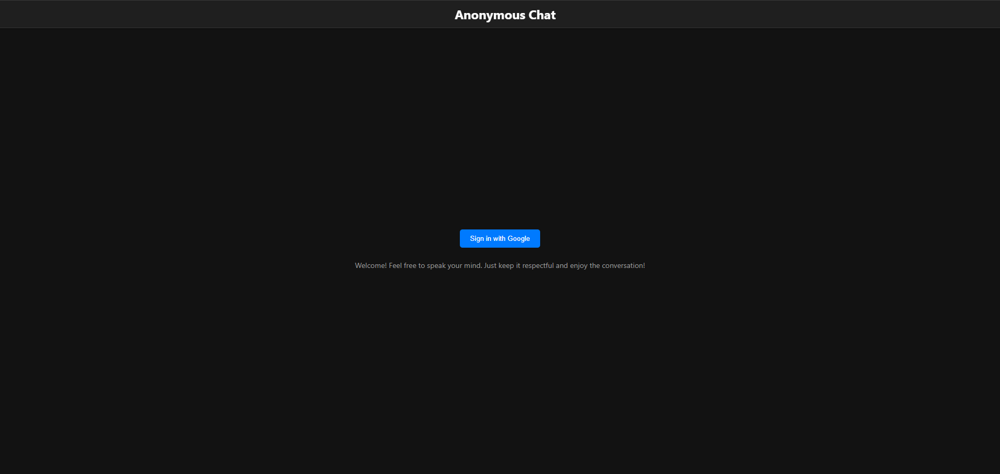
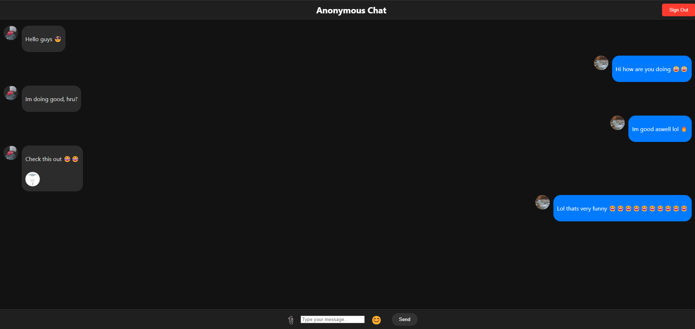

# Anonymous Chat - Building a Virtual Chat Application on My Own

Anonymous Chat is a real-time messaging application built using HTML, CSS, JavaScript, and Firebase. It allows users to send and receive messages instantly, leveraging Firebase's cloud services for real-time data syncing and storage.

## Preview


*This is the login page for the Anonymous Chat app, where users can enter the chat while using a google account.*

<br>


*This shows the chat in action, where users can send and receive messages in real-time.*

<br>

## How I Built It

The Anonymous Chat app was built using the following tools and technologies:
- **Firebase**: Used for real-time data synchronization and user authentication.
- **HTML, CSS, JavaScript**: Used to create the front-end interface, allowing users to interact with the chat.
- **Firebase Authentication**: Ensures that users can chat anonymously without creating an account.
- **Firebase Realtime Database**: Handles storing and retrieving messages in real-time.
- **Key files used in the build process:**
  - `index.html` (Main structure and layout of the chat app)
  - `style.css` (App's visual styling)
  - `app.js` (Handles Firebase interaction and real-time message updates)
  - `firebase-config.js` (Configuration for Firebase SDK and database connection)

## Future Plans

In the future, I plan to publish my chat app to the internet using either GitHub Pages or Firebase. However, I haven't published it yet because I need HTML to do so. Right now, I can only run the app locally since I only have JavaScript and CSS. Additionally, before making it live, I want to implement additional features, such as the ability to reply to messages, add reactions, and improve the overall user experience. My goal is to make the app cooler, more interactive, and better for users.

## Prerequisites

To build and run the Anonymous Chat App, you will need:

- A text editor such as [VS Code](https://code.visualstudio.com/).
- A web browser (e.g., Chrome, Firefox).
- [Firebase](https://firebase.google.com/) if you want to deploy it online (optional for local testing).

## Setup

1. Clone or download the repository to your local machine.
2. Open a terminal or command prompt.
3. Navigate to the project directory:
   ```sh
   cd chat
   ```
   
4. Install dependencies:
   ```sh
   npm install
   ```

5. Start the app locally using npm:
   ```sh
   npm start
   ```

## Future Deployment (Optional)

If you want to deploy the app online using Firebase, follow these steps (Only if there is HTML implemented):

1. Install Firebase CLI:
    ```sh
    npm install -g firebase-tools
    ```

2. Log in to Firebase:
    ```sh
    firebase login
    ```

3. Initialize Firebase in your project folder:
    ```sh
    firebase init
    ```

4. Choose the Firebase Hosting option during initialization.

5. Deploy your app:
    ```sh
    firebase deploy
    ```

Once deployed, Firebase will provide a URL where your chat app will be live!

## Cleanup

If you decide to delete your Firebase project or stop using it, you can run:
```sh
firebase projects delete
